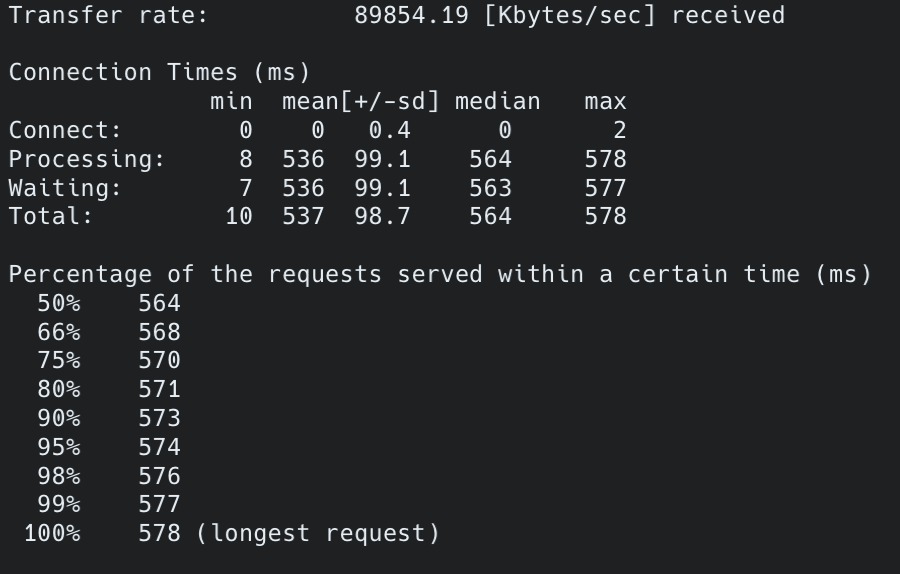
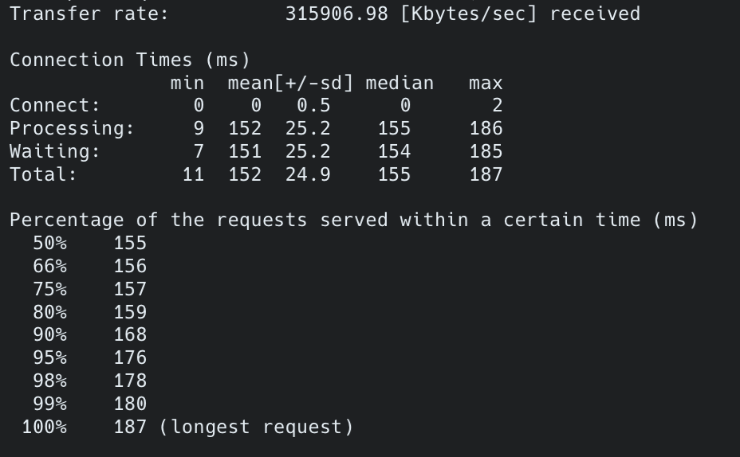
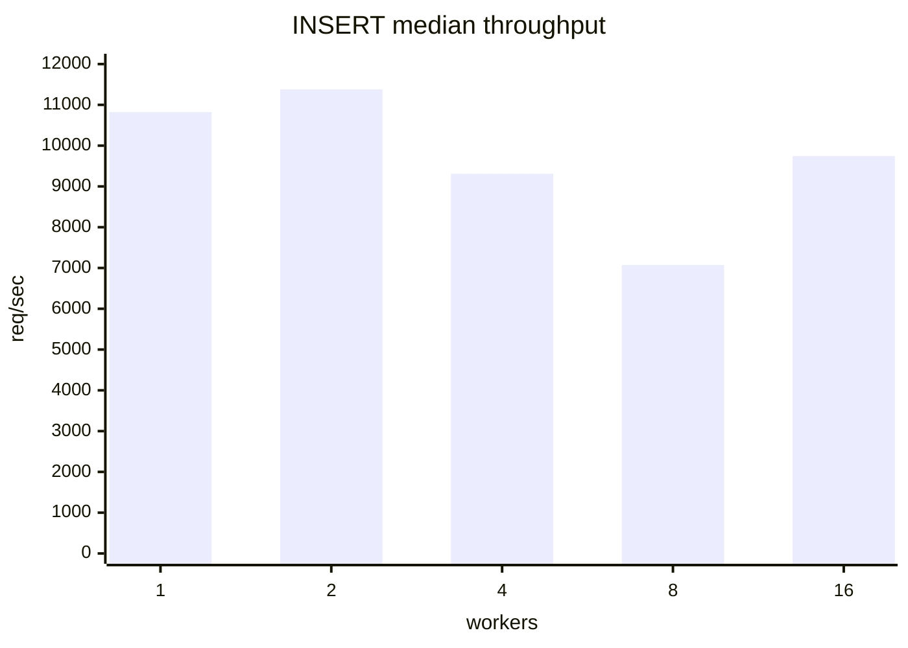
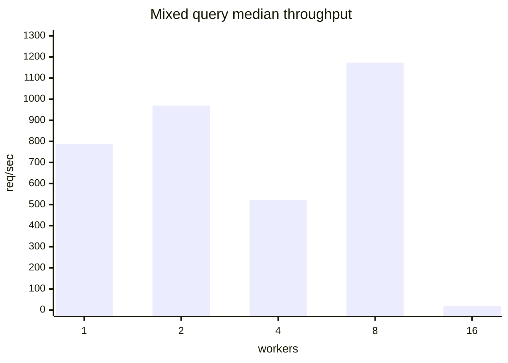
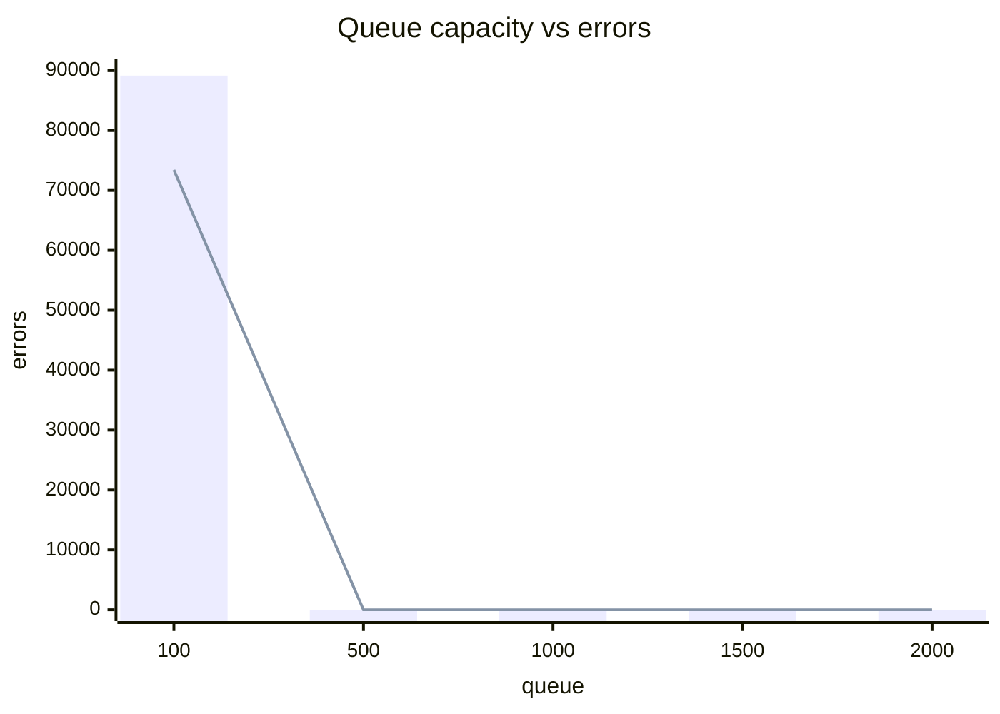

# Mini DBMS with HTTP API Server

<table>
  <tr>
    <td align="center"><b>Thread 1 (단일 스레드)</b></td>
    <td align="center"><b>Thread 128 (멀티 스레드)</b></td>
  </tr>
  <tr>
    <td></td>
    <td></td>
  </tr>
</table>

---

## 1. 프로젝트 배경 및 목표

기존에 만들었던 SQL 처리기와 DBMS를 외부 클라이언트에서 접근 가능하도록 HTTP API 서버로 확장하는 것이 목표입니다.

클라이언트는 HTTP 요청으로 SQL을 전송하고, 서버는 이를 파싱·실행한 뒤 결과를 반환.  
지원 쿼리: `SELECT` (WHERE, BETWEEN 포함), `INSERT`

---

## 2. 아키텍처

```
Client (curl / wrk)
        │  HTTP (TCP)
        ▼
   TCP Socket Server
        │  accept()
        ▼
   Thread Pool ──────────────── Circular Queue
        │  worker thread
        ▼
   Dispatcher
        │  HTTP 파싱 → SQL 추출
        ▼
   Engine Adapter  ◀── pthread_rwlock (write lock)
        │
        ▼
   SQL Pipeline
   ┌────────────────────────────────┐
   │ Lexer → Parser →  Schema 검증   │
   │          ↓                     │
   │       Executor                 │
   │          ↓                     │
   │    B+ Tree Index               │
   │          ↓                     │
   │      Data File (.dat)          │
   └────────────────────────────────┘
```

| 컴포넌트 | 역할 |
|---|---|
| TCP Socket Server | 클라이언트 연결 수락 (`accept` 루프) |
| Thread Pool | 고정 worker 스레드로 요청 처리 |
| Dispatcher | HTTP 파싱, SQL 추출, 응답 반환 |
| Engine Adapter | rwlock으로 SQL 실행 직렬화 |
| SQL Pipeline | Lexer → Parser → Schema → Executor |
| B+ Tree Index | 포인트·범위 쿼리 효율화 |

---

## 3. 핵심 구현

### 1) 네트워크 연결

TCP 소켓(`AF_INET`)을 열고 `SO_REUSEADDR`로 재시작 시 포트 충돌을 방지합니다.  
`accept` 루프에서 새 연결이 들어오면 Thread Pool에 작업을 제출하고 즉시 다음 연결을 대기합니다.  
Queue가 꽉 차면 `503 SERVICE_UNAVAILABLE`을 반환해 backpressure를 처리합니다.

```
클라이언트 연결
    → open_listen_socket()   # AF_INET, SO_REUSEADDR, backlog=1024
    → server_run()           # EINTR-safe accept loop
    → dispatcher_on_accept() # Thread Pool에 작업 제출
```

HTTP는 GET(쿼리 파라미터 `?sql=...`)과 POST(body) 모두 지원하며,  
Content-Length 기반으로 최대 65,536 bytes까지 읽습니다.

### 2) 동시성 제어

여러 클라이언트가 동시에 INSERT를 보내면 데이터 파일에 동시에 쓰려는 충돌이 발생합니다.  
이를 `pthread_rwlock`으로 해결합니다.

- **읽기(SELECT)**: 여러 스레드가 동시에 획득 가능 → 병렬 처리
- **쓰기(INSERT)**: 한 스레드만 독점 획득 → 다른 모든 읽기·쓰기 차단

```c
// engine_adapter.c
struct EngineAdapter {
    pthread_rwlock_t lock;
};

// 현재는 모든 쿼리에 write lock 적용 (Phase 1)
pthread_rwlock_wrlock(&adapter->lock);
execute_sql(...);
pthread_rwlock_unlock(&adapter->lock);
```

> B+ 트리의 fine-grained lock은 검토했으나, 구현 복잡도가 팀 학습 수준에 비해 과도하다고 판단해 global rwlock으로 대체했습니다.

### 3) Thread Pool

스레드를 요청마다 생성/소멸하면 context switching 비용이 커집니다.  
이를 방지하고자 고정 크기의 Thread Pool을 구현했습니다.

**구조**

```
Producer (accept loop)
    ↓  pthread_mutex + pthread_cond (not_full)
Circular Queue  [task0][task1]...[taskN]
    ↑  pthread_cond (not_empty)
Worker Threads  [W0][W1]...[Wk]
```

| 컴포넌트 | 역할 |
|---|---|
| `pthread_mutex_t mtx` | Queue 상태 보호 |
| `pthread_cond_t not_empty` | 작업 추가 시 worker 깨우기 |
| `pthread_cond_t not_full` | Queue 여유 공간 생길 때 producer 깨우기 |

**고정 스레드 선택 이유**  
동적 스레드 풀(부하에 따라 수 조절)도 고려했지만, 스레드 생성·소멸 오버헤드와 구현 복잡도 대비 성능 이득이 크지 않다고 판단했습니다.  
실무에서의 동적 운영 방식은 [쟁점 포인트](#5-쟁점-포인트)에서 다룹니다.

```
실행 예시
./sqlpd <port> [workers] [queue_capacity]
./sqlpd 8080 4 128
```

---

## 4. 데모

### 빌드 및 실행

```bash
# 빌드
make

# 테스트 데이터 생성 (200,000 rows)
make seed_users

# 서버 실행 (port=8080, workers=4, queue=128)
./sqlpd 8080 4 128
```

### SELECT

```bash
# 전체 조회
curl "http://localhost:8080/query?sql=SELECT%20*%20FROM%20users"

# 조건 조회
curl "http://localhost:8080/query?sql=SELECT%20*%20FROM%20users%20WHERE%20id%20%3D%201"

# 범위 조회
curl "http://localhost:8080/query?sql=SELECT%20*%20FROM%20users%20WHERE%20id%20BETWEEN%201%20AND%20100"
```

### INSERT

```bash
curl -X POST http://localhost:8080/query \
  -H "Content-Type: application/json" \
  -d '{"sql": "INSERT INTO users VALUES (999999, '\''alice'\'', 30, '\''alice@example.com'\'')"}'
```

### 응답 형식

**SELECT** — `text/plain` ASCII 테이블

```
+----+-------+-----+-------------------+
| id | name  | age | email             |
+----+-------+-----+-------------------+
| 1  | Alice | 30  | alice@example.com |
+----+-------+-----+-------------------+
(1 rows)
```

**INSERT** — `application/json`

```json
{"ok": true, "type": "insert", "affected_rows": 1}
```

**에러** — `application/json`

```json
{"ok": false, "error": {"code": "BAD_SQL", "message": "..."}}
```

---

## 5. 쟁점 포인트

### 1) 실무 DBMS Thread Pool 구성 방식

저희는 고정 크기 Thread Pool을 선택했지만, 실무 DBMS는 트래픽에 따라 스레드 수를 동적으로 운영합니다.

| DBMS | 방식 | 기본 스레드 수 | 특징 |
|---|---|---|---|
| MySQL | 고정 Thread Pool + 캐시 | 151개 | 스레드 재사용으로 생성 비용 절약 |
| PostgreSQL | 연결당 프로세스 | 100개 | 스레드 대신 프로세스, 안정성 높음 |
| MongoDB | 동적 Thread Pool | 부하에 따라 자동 조절 | 유연하지만 관리 복잡 |
| Java (ExecutorService) | 고정/동적 선택 가능 | 설정값 | mutex·queue·CV 추상화 제공 |

**공통 원칙**

- 기본값: **CPU 코어 수 × 2**
- 코어 수 초과 시 context switching 비용만 증가하고 처리량은 오르지 않음
- I/O 대기 구간에 다른 스레드가 실행될 수 있어 코어 수의 2배를 기준으로 사용

### 2) 시도해본 점 — 최적의 Thread 수와 Queue 길이 찾기

Thread Pool의 `workers` 수와 `queue_capacity`가 서버 동작에 어떤 영향을 주는지 `wrk`로 비교했다. 목적은 최고 처리량만 찾는 것이 아니라, 현재 서버 구조에서 503 에러와 대기시간을 함께 관찰하는 것이다.

현재 Mini DBMS는 SQL 실행 구간이 write lock으로 직렬화되어 있어 worker 수를 늘려도 처리량이 선형으로 증가하지 않는다. 따라서 workers와 queue는 순수 처리량 튜닝값이라기보다, 503 에러와 대기시간 사이의 trade-off를 조절하는 값으로 해석했다.

### 실험 조건

| 항목 | 값 |
|------|----|
| 측정 도구 | `wrk` + Lua script |
| 측정 시간 | 조건당 5초 x 3회 |
| 집계 방식 | RPS/latency는 median, errors/requests는 3회 합계 |
| 사전 데이터 | 매 run 시작 전 `data/users.dat`에 1,000행 seed |
| 일반 실험 | `wrk -t4 -c16` |
| queue 실험 | `wrk -t4 -c500` |
| 상세 결과 | `tests/bench_report.md` |
| 원본 데이터 | `tests/bench_latest_summary.tsv`, `tests/bench_latest_raw.tsv` |

`queue` 실험에서 `connections=500`을 사용한 이유는 실제 운영 동시 접속 수를 가정한 것이 아니라, 작은 queue에서 포화와 503 에러가 발생하는지 확인하기 위한 스트레스 조건이다. 다만 `wrk`는 closed-loop 방식이라 동시에 처리 중이거나 대기 중인 요청 수가 `connections` 값에 의해 제한된다. 따라서 `queue=500`부터 에러가 사라진 것은 서버 고유의 최적 queue를 찾았다기보다, 이번 `wrk -c500` 조건에서 설정한 동시 요청 수를 queue가 수용한 결과에 가깝다.

### 핵심 결과

이번 실험에서 가장 방어 가능한 실행값:

```bash
./sqlpd 8080 2 500
```

| 파라미터 | 값 | 해석 |
|---------|:------:|------|
| `workers` | 2 | INSERT median 처리량 최고, 혼합 쿼리에서 socket error 없이 가장 높은 처리량 |
| `queue_capacity` | 500 | `wrk -c500` 조건에서 에러가 사라진 수용량. 독립적인 최적 queue 값으로 보기는 어려움 |

`workers=2`는 이번 실험에서 안정적인 설정으로 볼 수 있다. 반면 `queue=500`은 100ms p95 SLO를 만족한 값도, 보편적인 최적값도 아니다. `wrk -c500`이라는 특수한 closed-loop 조건에서 에러가 사라진 값이며, 이번 실험만으로는 queue의 독립적인 최적값을 찾았다고 보기 어렵다. 실제 환경이나 open-loop 부하처럼 요청이 일정 속도로 계속 유입되는 조건에서는 queue가 503 에러와 tail latency를 조절하는 중요한 backpressure 파라미터가 된다.

### INSERT 처리량



| workers | median req/sec | p95 ms | socket errors |
|:-------:|---------------:|-------:|--------------:|
| 1 | 10,822.78 | 7.35 | 0 |
| 2 | 11,380.22 | 5.52 | 0 |
| 4 | 9,309.41 | 21.13 | 0 |
| 8 | 7,073.59 | 12.56 | 0 |
| 16 | 9,746.67 | 8.99 | 0 |

### 혼합 쿼리 처리량



| workers | median req/sec | p95 ms | socket errors |
|:-------:|---------------:|-------:|--------------:|
| 1 | 786.98 | 32.28 | 0 |
| 2 | 969.72 | 67.62 | 0 |
| 4 | 522.40 | 16.34 | 32 |
| 8 | 1,173.17 | 21.47 | 16 |
| 16 | 18.20 | 16.61 | 32 |

혼합 쿼리에서는 `workers=8`의 RPS가 가장 높았지만 socket error가 발생했다. 안정성을 우선하면 `workers=2`가 더 방어 가능한 설정이다.

### Queue 에러

아래 그래프에서 bar는 `Non-2xx`, line은 socket errors를 의미한다.



| queue | median req/sec | p95 ms | Non-2xx | socket errors |
|:-----:|---------------:|-------:|--------:|--------------:|
| 100 | 12,285.92 | 175.11 | 89,172 | 73,420 |
| 500 | 8,132.68 | 161.68 | 0 | 0 |
| 1,000 | 6,471.81 | 109.35 | 0 | 0 |
| 1,500 | 3,776.56 | 441.62 | 0 | 0 |
| 2,000 | 5,564.58 | 154.94 | 0 | 0 |

이 결과는 `queue=500`이 성능상 최적이라는 뜻이 아니다. `wrk -c500` 조건에서는 동시에 outstanding 상태인 요청 수가 대략 500개로 제한되므로, queue가 그 정도 크기가 되면 에러가 사라지는 것이 자연스럽다. 이번 queue 실험의 의미는 "최적 queue 산정"보다 "queue가 작으면 포화로 503/socket error가 발생하고, 충분히 크면 실패 대신 대기가 늘어난다"는 backpressure 특성을 확인한 데 있다.


조건은 환경 변수로 조정할 수 있다.

```bash
DURATION=10 RUNS=5 WRK_THREADS=4 WRK_CONNECTIONS=16 bash tests/bench_threadpool.sh 8080
QUEUE_CONNECTIONS=1000 QUEUE_VALUES="100 500 1000 1500 2000" bash tests/bench_threadpool.sh 8080
```

## 파일 구조

```
SQL Parser/
├── src/
│   ├── server_main.c        # 서버 진입점
│   ├── server/
│   │   ├── server.c         # TCP 소켓 서버
│   │   ├── threadpool.c     # Thread Pool
│   │   ├── dispatcher.c     # 요청 처리 및 라우팅
│   │   ├── engine_adapter.c # rwlock + SQL 실행 브릿지
│   │   ├── http_parser.c    # HTTP 요청 파싱
│   │   └── response.c       # HTTP 응답 포맷
│   ├── parser/parser.c      # SQL 파서
│   ├── input/lexer.c        # SQL 렉서
│   ├── executor/executor.c  # 쿼리 실행기
│   ├── schema/schema.c      # 스키마 로드·검증
│   └── bptree/bptree.c      # B+ 트리 인덱스
├── include/                 # 헤더 파일
├── schema/users.schema      # 테이블 스키마 정의
└── data/users.dat           # 데이터 파일
```
